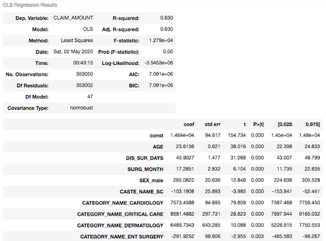

# Flagship Healthcare Program in India

### Objective
Analyzed India's community health insurance scheme from 2007-2020 and forecasted the future value of claims (Indian Rupee) using Multiple Linear Regression

#### Problem Definition

#### Tools Used
- Python
  - Libraries:
    - pandas
    - numpy
    - datetime 
    - matplotlib
    - seaborn
    - statsmodels.api
    - statsmodels.tools.tools
    - statsmodels.stats.outliers_influence
    - statsmodels.stats.stattools
    - statsmodels.stats.diagnostic
    - scipy.stats
    - statsmodels.tools.eval_measures
    - pylab    
- Spyder
- Repl
- Trello

#### Resources
- Kaggle - Andhra Pradesh Health Insurance Data
  - https://www.kaggle.com/phiitm/andhra-pradesh-health-data

#### Process
- Data Acquisition
  - Kaggle Dataset: Andhra Pradesh Health Insurance Data
  - Shape: 479,688 rows, 23 columns
- Data Cleaning
  - e.g. Uniformative or Repetitive Data, Duplicates, Null Values, Missing Data, Irregular Data (Outliers detection via plots or descriptive statistics), Inconsistent Data (e.g. Capitalization, Format)
- Data Wrangling & Anaysis
  - Transforming all categorical features (columns) to dummy variables
  - Dropping the chosen dependant variable (Claim Amount) from the dataframe and choosing the predictor variables
  - Running iteratively the Ordinary Least Square (OLS) test and checking the following indices:
    - DF Residuals
    - Df Model
    - R-Squared
    - Adj R-Squared
    - F-Statistic & Prob (F-statistic)
    - AIC & BIC
    - beta Coefficient 
    - T-Statistic & P-Value
    - Srandard Error for Coefficient
    - Confidence Interval for Coefficient
  - Checking the following assumptions:
    - Multicollinearity - VIF
    - AutoCorrelation - Durbin-Watson
    - Linearity
    - Homoskedasticity - Breusch-Pagan
    - Exogeneity of Residuals
    - Model Accuracy (RMSE) 
- Results

